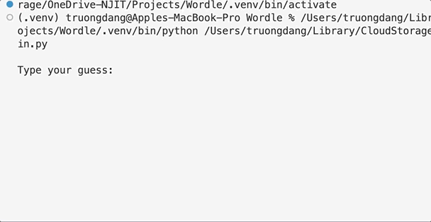

# Wordle in Python

*Create Wordle game in Python running on terminal*

## Attempt 1: CORRECT

- Input is shorter/longer than expected.
- Input does not have meaning.

## Attempt 2: CORRECT

- Easy solution.

## Attempt 3: WRONG --> LOSE

